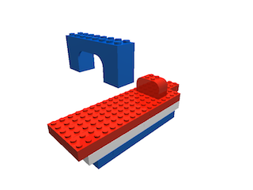
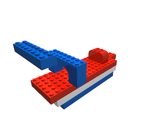
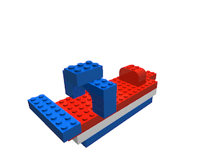

# ldraw-building-instructions

A small set of scripts to generate a series of images showing how
to build a Lego model from an .ldr file.

## Requirements
- [L3P](http://www.hassings.dk/l3/l3p.html)
- [POW-Ray](http://www.powray.org)
- [LDraw parts library](http://www.ldraw.org/parts/latest-parts.html)
- Perl

## Usage
- Create an .ldr model
- Edit `render` to the location of your l3p binary and LDraw library
- Run `generate-steps.pl your-model.ldr`
- Run `rendersteps` to generate the images. This takes around 1 minute for the supplied model file.

